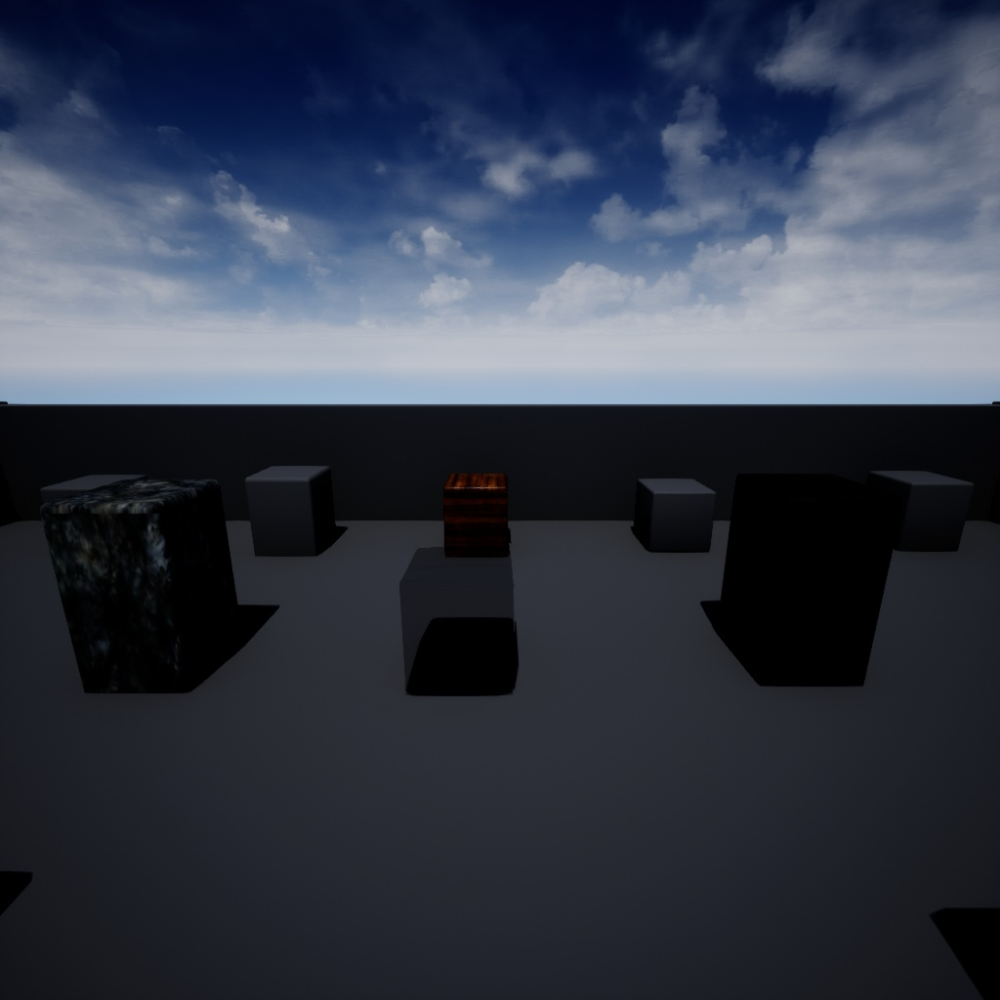

# UnrealCustomScreenCapture
Unreal Game Engine -- Custom Scene Capture 2D (export video feed out of game engine...)

## Initial results...

## Understand how 2D Screen Capture works in game
Let's add a static camera to blueprint game, then broadcast
its output to a simple box... think security camera broadcasting to a large screen tv inside of the game...
 - add a mesh cube as a screen (scale it nicely)
 - add Scene Capture 2D element to the level.
 - This will show up as a camera.  Translate/ rotate the camera appropriately.
 - In SceneCapture properties there is a choice for a Render Target.  
 - Two choices (CanvasRenderTarget2D or TextureRenderTarget2D)
 - Create TextureRenderTarget2D. Title: Camera Feed.  Store this in the Maps folder.
 - right click on the "Camera Feed", and create a material (Use default name)
 - let the material compile.  The output should be what the camera sees.
 - Drag and drop the material onto the cube screen we created earlier.
 - The output may show up as tiles. Adjust U and V settings until screen looks good.

Again, that is 1) SceneCapture2d 2) TextureRenderTarget2d 3) Material 4) Mesh cube

## But where are we really going?
Now I want to do this with a C++ class, the intent is to grab each video frame and 
process it with OpenCV...

The image display above was saved to simple binary file on disk, then opened up via OpenCV as `cv::Mat img(1024, 1024, CV_8UC4, rawDataBuffer)` and saved as .jpg from OpenCV.

